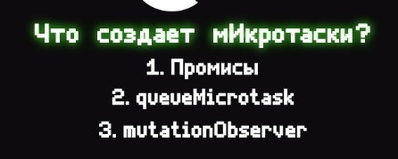
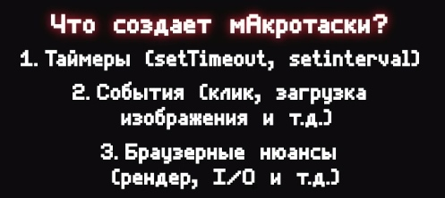

<!-- TOC -->

- [все вопросы](#%D0%B2%D1%81%D0%B5-%D0%B2%D0%BE%D0%BF%D1%80%D0%BE%D1%81%D1%8B)
  - [frontend](#frontend)
    - [Что такое DOM дерево?](#%D1%87%D1%82%D0%BE-%D1%82%D0%B0%D0%BA%D0%BE%D0%B5-dom-%D0%B4%D0%B5%D1%80%D0%B5%D0%B2%D0%BE)
    - [Как браузер рисует страницу?](#%D0%BA%D0%B0%D0%BA-%D0%B1%D1%80%D0%B0%D1%83%D0%B7%D0%B5%D1%80-%D1%80%D0%B8%D1%81%D1%83%D0%B5%D1%82-%D1%81%D1%82%D1%80%D0%B0%D0%BD%D0%B8%D1%86%D1%83)
    - [Отличие localStorage, sessionStorage и Cookie](#%D0%BE%D1%82%D0%BB%D0%B8%D1%87%D0%B8%D0%B5-localstorage-sessionstorage-%D0%B8-cookie)
  - [React](#react)
    - [Что такое React?](#%D1%87%D1%82%D0%BE-%D1%82%D0%B0%D0%BA%D0%BE%D0%B5-react)
    - [Какие основные преимущества есть в React ?](#%D0%BA%D0%B0%D0%BA%D0%B8%D0%B5-%D0%BE%D1%81%D0%BD%D0%BE%D0%B2%D0%BD%D1%8B%D0%B5-%D0%BF%D1%80%D0%B5%D0%B8%D0%BC%D1%83%D1%89%D0%B5%D1%81%D1%82%D0%B2%D0%B0-%D0%B5%D1%81%D1%82%D1%8C-%D0%B2-react-)
    - [Какие есть минусы в React ?](#%D0%BA%D0%B0%D0%BA%D0%B8%D0%B5-%D0%B5%D1%81%D1%82%D1%8C-%D0%BC%D0%B8%D0%BD%D1%83%D1%81%D1%8B-%D0%B2-react-)
    - [Что такое Virtual DOM в React?](#%D1%87%D1%82%D0%BE-%D1%82%D0%B0%D0%BA%D0%BE%D0%B5-virtual-dom-%D0%B2-react)
    - [Что такое props?](#%D1%87%D1%82%D0%BE-%D1%82%D0%B0%D0%BA%D0%BE%D0%B5-props)
    - [Что происходит когда вы вызываете setState?](#%D1%87%D1%82%D0%BE-%D0%BF%D1%80%D0%BE%D0%B8%D1%81%D1%85%D0%BE%D0%B4%D0%B8%D1%82-%D0%BA%D0%BE%D0%B3%D0%B4%D0%B0-%D0%B2%D1%8B-%D0%B2%D1%8B%D0%B7%D1%8B%D0%B2%D0%B0%D0%B5%D1%82%D0%B5-setstate)
    - [В чем смысл специального атрибута key?](#%D0%B2-%D1%87%D0%B5%D0%BC-%D1%81%D0%BC%D1%8B%D1%81%D0%BB-%D1%81%D0%BF%D0%B5%D1%86%D0%B8%D0%B0%D0%BB%D1%8C%D0%BD%D0%BE%D0%B3%D0%BE-%D0%B0%D1%82%D1%80%D0%B8%D0%B1%D1%83%D1%82%D0%B0-key)
    - [Что значит компонент mounted ?](#%D1%87%D1%82%D0%BE-%D0%B7%D0%BD%D0%B0%D1%87%D0%B8%D1%82-%D0%BA%D0%BE%D0%BC%D0%BF%D0%BE%D0%BD%D0%B5%D0%BD%D1%82-mounted-)
    - [Разница между контролируемым и неконтролируемым компонентом?](#%D1%80%D0%B0%D0%B7%D0%BD%D0%B8%D1%86%D0%B0-%D0%BC%D0%B5%D0%B6%D0%B4%D1%83-%D0%BA%D0%BE%D0%BD%D1%82%D1%80%D0%BE%D0%BB%D0%B8%D1%80%D1%83%D0%B5%D0%BC%D1%8B%D0%BC-%D0%B8-%D0%BD%D0%B5%D0%BA%D0%BE%D0%BD%D1%82%D1%80%D0%BE%D0%BB%D0%B8%D1%80%D1%83%D0%B5%D0%BC%D1%8B%D0%BC-%D0%BA%D0%BE%D0%BC%D0%BF%D0%BE%D0%BD%D0%B5%D0%BD%D1%82%D0%BE%D0%BC)
    - [Что аткое react fragment ?](#%D1%87%D1%82%D0%BE-%D0%B0%D1%82%D0%BA%D0%BE%D0%B5-react-fragment-)
    - [Как реакт обрабатывает пользовательские события ?](#%D0%BA%D0%B0%D0%BA-%D1%80%D0%B5%D0%B0%D0%BA%D1%82-%D0%BE%D0%B1%D1%80%D0%B0%D0%B1%D0%B0%D1%82%D1%8B%D0%B2%D0%B0%D0%B5%D1%82-%D0%BF%D0%BE%D0%BB%D1%8C%D0%B7%D0%BE%D0%B2%D0%B0%D1%82%D0%B5%D0%BB%D1%8C%D1%81%D0%BA%D0%B8%D0%B5-%D1%81%D0%BE%D0%B1%D1%8B%D1%82%D0%B8%D1%8F-)
    - [Назовите основные жизненные циклы приложения компонента?](#%D0%BD%D0%B0%D0%B7%D0%BE%D0%B2%D0%B8%D1%82%D0%B5-%D0%BE%D1%81%D0%BD%D0%BE%D0%B2%D0%BD%D1%8B%D0%B5-%D0%B6%D0%B8%D0%B7%D0%BD%D0%B5%D0%BD%D0%BD%D1%8B%D0%B5-%D1%86%D0%B8%D0%BA%D0%BB%D1%8B-%D0%BF%D1%80%D0%B8%D0%BB%D0%BE%D0%B6%D0%B5%D0%BD%D0%B8%D1%8F-%D0%BA%D0%BE%D0%BC%D0%BF%D0%BE%D0%BD%D0%B5%D0%BD%D1%82%D0%B0)
    - [Что такое react reconsilation?](#%D1%87%D1%82%D0%BE-%D1%82%D0%B0%D0%BA%D0%BE%D0%B5-react-reconsilation)
  - [redux/toolkit - other State Manager](#reduxtoolkit---other-state-manager)
    - [Что такое Redux?](#%D1%87%D1%82%D0%BE-%D1%82%D0%B0%D0%BA%D0%BE%D0%B5-redux)
  - [сеть](#%D1%81%D0%B5%D1%82%D1%8C)
  - [ts js](#ts-js)
    - [типы данных, чем объект отличается от примитивов?](#%D1%82%D0%B8%D0%BF%D1%8B-%D0%B4%D0%B0%D0%BD%D0%BD%D1%8B%D1%85-%D1%87%D0%B5%D0%BC-%D0%BE%D0%B1%D1%8A%D0%B5%D0%BA%D1%82-%D0%BE%D1%82%D0%BB%D0%B8%D1%87%D0%B0%D0%B5%D1%82%D1%81%D1%8F-%D0%BE%D1%82-%D0%BF%D1%80%D0%B8%D0%BC%D0%B8%D1%82%D0%B8%D0%B2%D0%BE%D0%B2)
    - [разные методы объявления функций в js/ts ?](#%D1%80%D0%B0%D0%B7%D0%BD%D1%8B%D0%B5-%D0%BC%D0%B5%D1%82%D0%BE%D0%B4%D1%8B-%D0%BE%D0%B1%D1%8A%D1%8F%D0%B2%D0%BB%D0%B5%D0%BD%D0%B8%D1%8F-%D1%84%D1%83%D0%BD%D0%BA%D1%86%D0%B8%D0%B9-%D0%B2-jsts-)
    - [ОТличие const, let и var ?](#%D0%BE%D1%82%D0%BB%D0%B8%D1%87%D0%B8%D0%B5-const-let-%D0%B8-var-)
    - [Что такое промис? Что возвращает метод промиса?](#%D1%87%D1%82%D0%BE-%D1%82%D0%B0%D0%BA%D0%BE%D0%B5-%D0%BF%D1%80%D0%BE%D0%BC%D0%B8%D1%81-%D1%87%D1%82%D0%BE-%D0%B2%D0%BE%D0%B7%D0%B2%D1%80%D0%B0%D1%89%D0%B0%D0%B5%D1%82-%D0%BC%D0%B5%D1%82%D0%BE%D0%B4-%D0%BF%D1%80%D0%BE%D0%BC%D0%B8%D1%81%D0%B0)
    - [Преобразование типов](#%D0%BF%D1%80%D0%B5%D0%BE%D0%B1%D1%80%D0%B0%D0%B7%D0%BE%D0%B2%D0%B0%D0%BD%D0%B8%D0%B5-%D1%82%D0%B8%D0%BF%D0%BE%D0%B2)
    - [Что такое чистая, грязная функция ?](#%D1%87%D1%82%D0%BE-%D1%82%D0%B0%D0%BA%D0%BE%D0%B5-%D1%87%D0%B8%D1%81%D1%82%D0%B0%D1%8F-%D0%B3%D1%80%D1%8F%D0%B7%D0%BD%D0%B0%D1%8F-%D1%84%D1%83%D0%BD%D0%BA%D1%86%D0%B8%D1%8F-)
    - [Что такое функциональная перегрузка?](#%D1%87%D1%82%D0%BE-%D1%82%D0%B0%D0%BA%D0%BE%D0%B5-%D1%84%D1%83%D0%BD%D0%BA%D1%86%D0%B8%D0%BE%D0%BD%D0%B0%D0%BB%D1%8C%D0%BD%D0%B0%D1%8F-%D0%BF%D0%B5%D1%80%D0%B5%D0%B3%D1%80%D1%83%D0%B7%D0%BA%D0%B0)
  - [Html](#html)
    - [Что такое семантическая верстка ?](#%D1%87%D1%82%D0%BE-%D1%82%D0%B0%D0%BA%D0%BE%D0%B5-%D1%81%D0%B5%D0%BC%D0%B0%D0%BD%D1%82%D0%B8%D1%87%D0%B5%D1%81%D0%BA%D0%B0%D1%8F-%D0%B2%D0%B5%D1%80%D1%81%D1%82%D0%BA%D0%B0-)
  - [css/scss](#cssscss)
    - [Что такое css и каскад?](#%D1%87%D1%82%D0%BE-%D1%82%D0%B0%D0%BA%D0%BE%D0%B5-css-%D0%B8-%D0%BA%D0%B0%D1%81%D0%BA%D0%B0%D0%B4)
    - [Как работает наследовательность и специфичность ?](#%D0%BA%D0%B0%D0%BA-%D1%80%D0%B0%D0%B1%D0%BE%D1%82%D0%B0%D0%B5%D1%82-%D0%BD%D0%B0%D1%81%D0%BB%D0%B5%D0%B4%D0%BE%D0%B2%D0%B0%D1%82%D0%B5%D0%BB%D1%8C%D0%BD%D0%BE%D1%81%D1%82%D1%8C-%D0%B8-%D1%81%D0%BF%D0%B5%D1%86%D0%B8%D1%84%D0%B8%D1%87%D0%BD%D0%BE%D1%81%D1%82%D1%8C-)
    - [Мобайл версстка и адаптивная верстка что знаешь?](#%D0%BC%D0%BE%D0%B1%D0%B0%D0%B9%D0%BB-%D0%B2%D0%B5%D1%80%D1%81%D1%81%D1%82%D0%BA%D0%B0-%D0%B8-%D0%B0%D0%B4%D0%B0%D0%BF%D1%82%D0%B8%D0%B2%D0%BD%D0%B0%D1%8F-%D0%B2%D0%B5%D1%80%D1%81%D1%82%D0%BA%D0%B0-%D1%87%D1%82%D0%BE-%D0%B7%D0%BD%D0%B0%D0%B5%D1%88%D1%8C)

<!-- /TOC -->

# все вопросы

## frontend

### Что такое DOM дерево?

- Ответ

  DOM — это объектная модель документа, на основании HTML-кода. Иными словами, это представление HTML-документа в виде дерева тегов. Нужно для нормальной стилизации и взаимодействия с js

---

### Как браузер рисует страницу?

- Ответ

  есть некое render tree которое из себя представляет то, какие этапы есть в рендере страницы,

  1. парсинг html и css
  2. составляется ДОМ дерево и styles rules
  3. соединяются между собой
  4. создается render tree
  5. покраска страницы
  6. отображение

  

---

### Отличие localStorage, sessionStorage и Cookie

- Ответ

  Локал сторадж, нужен для того что бы хранить данные клиента между сессиями, буквально клиентский кеш браузера, подходит для хранения пользовательских тем и тд.

  Сессион сторейдж подходит для хранения данных в пределах одной сессии браузера.

  Куки подходят для хранения серкретов которые помогут общаться с бекэндом из за того, что они автоматически прокидываются в каждый рест запрос, так же можно устанавливать специальные флаги, которые позволяют запретить джаваскрипту взаимодействовать с ними, что бы куки отправлялись только по https, задавать дату убивания, задавать пути для отправки кук.

---

## React

### Что такое React?

- Ответ

  это JavaScript библиотека для разработки пользовательского интерфейса.

  React пропагандирует компонентный подход разработки, тоесть можно сказать некоторые строительные блоки
  UI которые могут быть переиспользуемые

---

### Какие основные преимущества есть в React ?

- Ответ
  React оптимизирует процесс отрисовки.
  Легко интегрируется с другими фреймворками.
  Не сложно писать Unit тесты.

---

### Какие есть минусы в React ?

- Ответ

  1. Это библиотека и без его экосистемы не так много функционала из коробки(валидация форм и тд.).
  2. сложность отделения бизнес логики от ui компонентов.
  3. костыльность с хуками
  4. невозможность обрабатывать запрсы в интернет нигде кроме как useEffect(спорный минус можно и не называть)

---

### Что такое Virtual DOM в React?

- Ответ

  Это киллер фича реакта.

  Из-за того что самые затратные операции это взаимодействия с ДОМ деревом, фейсбук придумала концепцию Virtual Dоm.
  Это javascript объект, и когда происходят какие то действия в реакте то сначала изменения применяются к Virtual DOM,
  потом сравнивается VIRTUAL DOM и реальное дом дерево, и в реальном дом дереве заменялись только те компоненты, которые были изменены в Virtual DOM, что помогает сильно оптимизировать приложения

---

### Что такое props?

- Ответ

  - пропс это свойства, и они помогают выстраивать взаимодействия между родительским компонентом и дочерним за счет
    передачи свойств

---

### Что происходит когда вы вызываете setState?

- Ответ

  Для начала берется объект который мы передаем в setState и начинает его соединять с прошлым стейтом.
  Дальше реакт на основе нового стейта создает новый Virtual DOM.
  Затем он находит только те элементы, которые были изменены и заменяет их в реальном DOM дереве.

---

### В чем смысл специального атрибута key?

- Ответ

  Так как реакт позволяет переиспользовать одинаковые компоненты любое кол-во раз, из-за этого рект требует что бы у каждого повторяющего компонента был свой уникальный идентификатор key, которые поможет реакту понять какой именно компонент был изменен и ререндерить именно его, а не абсолютно все.

  Так же в результирующем ДОМ дереве этого атрибута нет, это атрибут для реакта.

---

### Что значит компонент mounted ?

- Ответ

  это значит что компонент непосредственно вмонтирован в дом дерево.

---

### Разница между контролируемым и неконтролируемым компонентом?

- Ответ

  контролируемый компонент, это такой компонент в котором присутствует состояние за которым мы следим, допустим
  это может быть какой то input, на каждое изменения которого мы вызываем какое то действие.

  В то время неконтролируемый компонент, это такой компонент который как бы тоже имеет состояние, но изменение состояние которого мы не обрабатываем.

---

### Что аткое react fragment ?

- Ответ

  из-за того что реакт не позволяет в компоненте описывать больше чем 1 Главный тег, а есть ситуации когда не хочется иметь какой то главенствующий тег. Вот для таких случаев и придумали реакт фрагмент, это пустой тег, который оборачивается весь компонент, который при рендере не имеет ничего и не создает лишнии узлы

---

### Как реакт обрабатывает пользовательские события ?

- Ответ

  Стоит отметить что реакт не добавляет множество событий в приложение, а реакт добавляет 1 главное событие для корневого элемента, которые уже понимает по какому именно компоненту мы кликнули и обрабатывает то или иное действие.

  Так же реакт имеет Syntatick event - это обертка которая оборачивает все события и предоставляет общий API для работы с ними.

---

### Назовите основные жизненные циклы приложения компонента?

- Ответ

  - initialization
    setup props and state

  - Mounting
    componentWIllMount => render => componentDidMount

  - Updaiting
    props - componentWillReciveProps => shouldComponentUpdate => componentWillUpdate => render => componentDidUpdated
    state - shouldComponentUpdate => componentWillUpdate => render => componentDidUpdated

  - Unmounting
    compontneWillUnmount (удаления всех стейтов, слушателей и тд)

---

### Что такое react reconsilation?

- Ответ

react reconsilation это механизм сравнения двух вирутальных ui деревьев, который находит изменения и применяет их
и есть 3 эвристических правила(какой то набор правил которые ускоряет и облегчает выполнения сложных операций(как я понял)).

- 1.  Что реакт сравинвает компоненты последовательно и позиционно,
      то есть элемент на позиции а он будет сравнивать с новым элементом на позиции а

- 2. Если поменялся тип элемента(div -> span , etc.), то он не смотрит внутрь этого компонента
     и сразу анмаунтить и манутить его заново.

- 3. Если у компонентов есть кеи то реакт сперва пробегается по всем ключам, затем сравнивает позицию
     по ключам и уже переставляет элементы вместо ререндер. У этих компонентов будет сохраняться стейт и все такое

из этого стоит учитывать что всякие враперы не нужно менять динамически, иначе всегда все будщет перемаунтиться нафик

индексный кей ставить не всегда хорошо ведь, допустиим при сортировки если у тебя индексный кей то он все компоненты в списке которые поменяли своб поззицию, будет все перемонтировать, и лучше всегда указывать в виде кея условный userId, что бы не было перерендеров, а была только перестановка, и условно состояние юузеров сохранилось.

нельзя делатьт рандомные кеи, может произойти пиздец когда все перемаунтиться.

---

## redux/toolkit - other State Manager

### Что такое Redux?

- Ответ

  Это глобальный стейт менеджер приложения, которое помогает контролировать состояние приложения глобально хранить и обрабатывать именно поток данных и затем связывать их уже с реактом, тоесть из всех компонентов иметь доступ к какому то состоянию, и возможность взаимодействовать с ним.

---

## сеть

## ts (js)

- Вообще в целом почти все в джаваскрипте является объектом

---

### типы данных, чем объект отличается от примитивов?

- Ответ

  всего 8

  null
  undefiend
  object
  bigint
  number
  string
  boolean

  Отличия, что объект может быть сложным типом данных, который может содержать в себе другие примитивы или объекты.
  Так же у оюъектов есть методы. Чего нет у примитивов, но как я знаю js оборачивает примитивы в объекты, чтобы у него появились методы.

  Так же отличия что объекты хранятся в памяти браузера по ссылке, в то время как примиты нет.

---

### разные методы объявления функций в js/ts ?

- Ответ

  В javascript есть function devalration это функции которые были объявлены как function name() {},
  а есть function expression это функции которые были присвоены к переменной.

  Отличия в том что если ты вызорвешь function declaration выше чем ты ее определили то она вызовется,
  а function exprerssion нет.

  Это связано с тем что функции declaration они поднимаются сразу вверх в текущей области видимости,
  такое механизм называется hosting, что как раз и позволяет вызвать ее до того как она была объявлена,
  а вот function expression нет.

  В стрелочных функциях и в целом expression область видимости определяется в момент инициализации функции,
  а не в момент вызова функции

---

### ОТличие const, let и var ?

- Ответ

const это неизменяемый тип данных.
let это изменяемый тип данных, но он изменяется только в области видимости функции условной, а не глобально.
var это изменяемый тип данных, который если меняется то меняется глоабально, еще есть штука что если вар инициализирован но не объявлен он будет всегда равен undefiend и не будет ошибки.

### Что такое промис? Что возвращает метод промиса?

- Ответ

  Промис это объект который выполняет какое то асинхронное событие и возвращает статус этого события либо результат(resolve, reject).

  Любой метод промиса возвращает еще 1 промис.

---

### Преобразование типов

- Ответ

  преобразование типов в js это процесс когда javascript под капотом, из за того что это динамический язык
  преобразует 1 тип в другой и есть два типа
  явные и неявные
  так же есть числовые, строковые и булевые.
  пример неявного что допустим ты в иф пишешь number тип, а он как бы должен работать с булевыми и в итоге
  js под капотом преобразует номер в булевое значение и с ним уже иф делает

  пример числового неявного что ты допустим "5" + 2 = "52" а "5" - 2 = 3 а вообще "5" + - 2 = "5 - 2"

---

### Что такое чистая, грязная функция ?

- Ответ

  чистая функция эта та функиця которая не имеет сайд эффектов(то есть не изменяет ничего вне себя), и при одинаковых инпут параметров
  будет возвращать один и тот же результат.
  Грязная функиця полная противоположность чистой.

  Привер чистой и грязной функции

  ```typescript
  const sum = (a: number, b: number): number => {
    return a + b;
  }; //чистая  функция, нету сайдэффекто, возвращает всегда одинг и тот же ответ при одинх и тех же инпутов

  let count = 0;

  const increment = () => {
    counter++;
    return counter;
  };

  //грязная функция ведь возврашщает всегда разные значения и имеет сайд эффекты в виде изменения состояния коунтер вне самой функции
  ```

---

### Event Loop

- Ответ

сначала синхронные задачи -> микротаски (очередь задач)(все абсолютно) -> макро таски (очередь событий)

 | 

---

### Что такое функциональная перегрузка?

- Ответ

  это механиз который позволяет для функции с одним и тем же именем задать 2 или более реализации в зависимости от кол-во переданных параметров.
  Тоесть ты можешь определить сигнатуры функции, а затем реализовать эту функцию с разными действиями в зависимости от кол-ва переданных параметров.

  Допустим как это может выглядит в typescript

  ```typescript
  function greet(name: string): string;
  function greet(firstName: string, lastName: string): string; //определяешь две сигнатуры
  function greet(name: string, name2?: string): string {
    //реализуешь функцию с вариативностью исходя из кол-во переданных аргументво
    if (name2) {
      return `Hello, ${name} ${name2}!`;
    } else {
      return `Hello, ${name}!`;
    }
  }

  console.log(greet("Alice")); // Hello, Alice!
  console.log(greet("Bob", "Smith")); // Hello, Bob Smith!
  ```

---

## Html

### Что такое семантическая верстка ?

- Ответ

это верстка с использованием тегов header section articles title и тд, которая помогает улучшить читаемость кода для человека, а так же помогает при сео оптимизации, тем что вед кравлеры лучше понимают html код, и может дорпустим выдавать в поисковых запросах сразу допустим карточку с товаром с вашего сайта

Она нужна для улучшения SEO оптимизации страницы, а также для улучшения читаемости кода.

## css/scss

### Что такое css и каскад?

- Ответ

  css это язык описания внешнего вида документа, то есть у нас есть какой то набор стилей, есть какие то селекторы
  и мы тюним наши элементы.
  Чем ниже написан css стиль, тем актуальнее он и значитт он и бюудет применяться.

  Приоритетность

  id => class => tag

  Каскад это и есть про порядок применениям и наложение css стилей друг на друга.

---

### Как работает наследовательность и специфичность ?

- Ответ

  C Родительского компонента перекидываются стили на дочернии, кроме display свойства.

  Специфичность это то, что именно определяет приоритетность, тоесть id -> class -> tag.
  Так же есть штуки по типу ::child-last и задавать классы ему

---

### Мобайл версстка и адаптивная верстка что знаешь?

- Ответ

  сначала идет mobile firtst, то есть верстаешь сначала для телефеона.

  есть response design - это когда у тебя приложение подстраивается под любые размеры экрана
  автоматически

  есть adaptive - тоесть через медиазапросы и брейкпоинты.

  в моем понимании респонсив подходит для не сложных в плане адаптивности приложений, в отличии от адаптивной.

---
