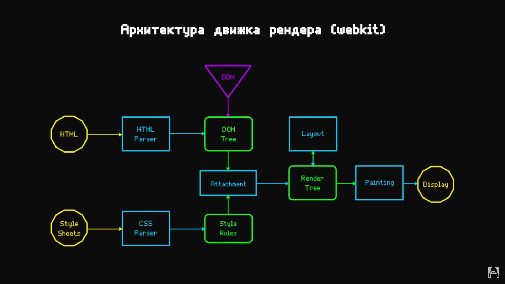
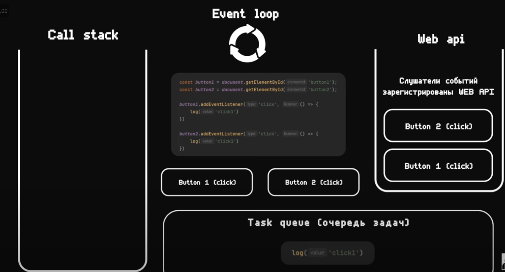
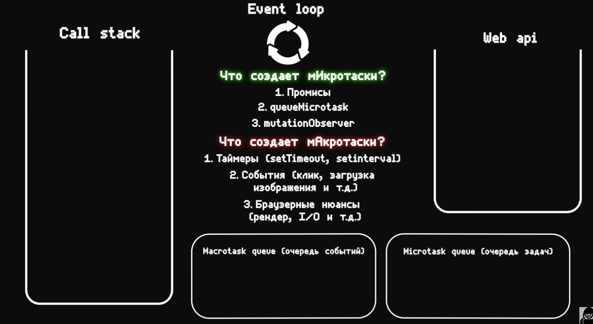
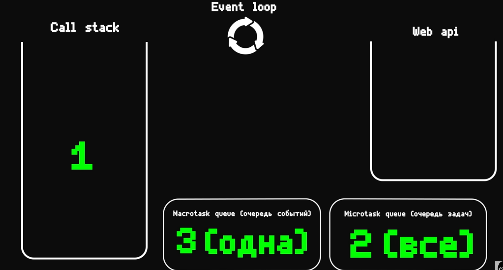

<!-- TOC -->

- [все вопросы](#%D0%B2%D1%81%D0%B5-%D0%B2%D0%BE%D0%BF%D1%80%D0%BE%D1%81%D1%8B) - [Принципе программирования?](#%D0%BF%D1%80%D0%B8%D0%BD%D1%86%D0%B8%D0%BF%D0%B5-%D0%BF%D1%80%D0%BE%D0%B3%D1%80%D0%B0%D0%BC%D0%BC%D0%B8%D1%80%D0%BE%D0%B2%D0%B0%D0%BD%D0%B8%D1%8F) - [принципы проектирования](#%D0%BF%D1%80%D0%B8%D0%BD%D1%86%D0%B8%D0%BF%D1%8B-%D0%BF%D1%80%D0%BE%D0%B5%D0%BA%D1%82%D0%B8%D1%80%D0%BE%D0%B2%D0%B0%D0%BD%D0%B8%D1%8F)
  - [frontend](#frontend)
    - [Что такое DOM дерево?](#%D1%87%D1%82%D0%BE-%D1%82%D0%B0%D0%BA%D0%BE%D0%B5-dom-%D0%B4%D0%B5%D1%80%D0%B5%D0%B2%D0%BE)
    - [Что такое cors ?](#%D1%87%D1%82%D0%BE-%D1%82%D0%B0%D0%BA%D0%BE%D0%B5-cors-)
    - [Как браузер рисует страницу?](#%D0%BA%D0%B0%D0%BA-%D0%B1%D1%80%D0%B0%D1%83%D0%B7%D0%B5%D1%80-%D1%80%D0%B8%D1%81%D1%83%D0%B5%D1%82-%D1%81%D1%82%D1%80%D0%B0%D0%BD%D0%B8%D1%86%D1%83)
    - [Отличие localStorage, sessionStorage и Cookie](#%D0%BE%D1%82%D0%BB%D0%B8%D1%87%D0%B8%D0%B5-localstorage-sessionstorage-%D0%B8-cookie)
    - [как можно дефолтный кеш get запроса ?](#%D0%BA%D0%B0%D0%BA-%D0%BC%D0%BE%D0%B6%D0%BD%D0%BE-%D0%B4%D0%B5%D1%84%D0%BE%D0%BB%D1%82%D0%BD%D1%8B%D0%B9-%D0%BA%D0%B5%D1%88-get-%D0%B7%D0%B0%D0%BF%D1%80%D0%BE%D1%81%D0%B0-)
    - [Оптионс http запрос, зачем?](#%D0%BE%D0%BF%D1%82%D0%B8%D0%BE%D0%BD%D1%81-http-%D0%B7%D0%B0%D0%BF%D1%80%D0%BE%D1%81-%D0%B7%D0%B0%D1%87%D0%B5%D0%BC)
    - [Как билдится приложение ?](#%D0%BA%D0%B0%D0%BA-%D0%B1%D0%B8%D0%BB%D0%B4%D0%B8%D1%82%D1%81%D1%8F-%D0%BF%D1%80%D0%B8%D0%BB%D0%BE%D0%B6%D0%B5%D0%BD%D0%B8%D0%B5-)
    - [Что такое SPA ?](#%D1%87%D1%82%D0%BE-%D1%82%D0%B0%D0%BA%D0%BE%D0%B5-spa-)
    - [Что такое ssr, ssg, isg ?](#%D1%87%D1%82%D0%BE-%D1%82%D0%B0%D0%BA%D0%BE%D0%B5-ssr-ssg-isg-)
    - [отличие svg, jpeg и png](#%D0%BE%D1%82%D0%BB%D0%B8%D1%87%D0%B8%D0%B5-svg-jpeg-%D0%B8-png)
  - [React](#react)
    - [Что такое React?](#%D1%87%D1%82%D0%BE-%D1%82%D0%B0%D0%BA%D0%BE%D0%B5-react)
    - [Какие основные преимущества есть в React ?](#%D0%BA%D0%B0%D0%BA%D0%B8%D0%B5-%D0%BE%D1%81%D0%BD%D0%BE%D0%B2%D0%BD%D1%8B%D0%B5-%D0%BF%D1%80%D0%B5%D0%B8%D0%BC%D1%83%D1%89%D0%B5%D1%81%D1%82%D0%B2%D0%B0-%D0%B5%D1%81%D1%82%D1%8C-%D0%B2-react-)
    - [Какие есть минусы в React ?](#%D0%BA%D0%B0%D0%BA%D0%B8%D0%B5-%D0%B5%D1%81%D1%82%D1%8C-%D0%BC%D0%B8%D0%BD%D1%83%D1%81%D1%8B-%D0%B2-react-)
    - [Что такое Virtual DOM в React?](#%D1%87%D1%82%D0%BE-%D1%82%D0%B0%D0%BA%D0%BE%D0%B5-virtual-dom-%D0%B2-react)
    - [Что такое shadow Dom ?](#%D1%87%D1%82%D0%BE-%D1%82%D0%B0%D0%BA%D0%BE%D0%B5-shadow-dom-)
    - [Что такое props?](#%D1%87%D1%82%D0%BE-%D1%82%D0%B0%D0%BA%D0%BE%D0%B5-props)
    - [Что происходит когда вы вызываете setState?](#%D1%87%D1%82%D0%BE-%D0%BF%D1%80%D0%BE%D0%B8%D1%81%D1%85%D0%BE%D0%B4%D0%B8%D1%82-%D0%BA%D0%BE%D0%B3%D0%B4%D0%B0-%D0%B2%D1%8B-%D0%B2%D1%8B%D0%B7%D1%8B%D0%B2%D0%B0%D0%B5%D1%82%D0%B5-setstate)
    - [В чем смысл специального атрибута key?](#%D0%B2-%D1%87%D0%B5%D0%BC-%D1%81%D0%BC%D1%8B%D1%81%D0%BB-%D1%81%D0%BF%D0%B5%D1%86%D0%B8%D0%B0%D0%BB%D1%8C%D0%BD%D0%BE%D0%B3%D0%BE-%D0%B0%D1%82%D1%80%D0%B8%D0%B1%D1%83%D1%82%D0%B0-key)
    - [Что значит компонент mounted ?](#%D1%87%D1%82%D0%BE-%D0%B7%D0%BD%D0%B0%D1%87%D0%B8%D1%82-%D0%BA%D0%BE%D0%BC%D0%BF%D0%BE%D0%BD%D0%B5%D0%BD%D1%82-mounted-)
    - [Разница между контролируемым и неконтролируемым компонентом?](#%D1%80%D0%B0%D0%B7%D0%BD%D0%B8%D1%86%D0%B0-%D0%BC%D0%B5%D0%B6%D0%B4%D1%83-%D0%BA%D0%BE%D0%BD%D1%82%D1%80%D0%BE%D0%BB%D0%B8%D1%80%D1%83%D0%B5%D0%BC%D1%8B%D0%BC-%D0%B8-%D0%BD%D0%B5%D0%BA%D0%BE%D0%BD%D1%82%D1%80%D0%BE%D0%BB%D0%B8%D1%80%D1%83%D0%B5%D0%BC%D1%8B%D0%BC-%D0%BA%D0%BE%D0%BC%D0%BF%D0%BE%D0%BD%D0%B5%D0%BD%D1%82%D0%BE%D0%BC)
    - [Что аткое react fragment ?](#%D1%87%D1%82%D0%BE-%D0%B0%D1%82%D0%BA%D0%BE%D0%B5-react-fragment-)
    - [Как реакт обрабатывает пользовательские события ?](#%D0%BA%D0%B0%D0%BA-%D1%80%D0%B5%D0%B0%D0%BA%D1%82-%D0%BE%D0%B1%D1%80%D0%B0%D0%B1%D0%B0%D1%82%D1%8B%D0%B2%D0%B0%D0%B5%D1%82-%D0%BF%D0%BE%D0%BB%D1%8C%D0%B7%D0%BE%D0%B2%D0%B0%D1%82%D0%B5%D0%BB%D1%8C%D1%81%D0%BA%D0%B8%D0%B5-%D1%81%D0%BE%D0%B1%D1%8B%D1%82%D0%B8%D1%8F-)
    - [Как реакт понимает когда нужно перерендериться?](#%D0%BA%D0%B0%D0%BA-%D1%80%D0%B5%D0%B0%D0%BA%D1%82-%D0%BF%D0%BE%D0%BD%D0%B8%D0%BC%D0%B0%D0%B5%D1%82-%D0%BA%D0%BE%D0%B3%D0%B4%D0%B0-%D0%BD%D1%83%D0%B6%D0%BD%D0%BE-%D0%BF%D0%B5%D1%80%D0%B5%D1%80%D0%B5%D0%BD%D0%B4%D0%B5%D1%80%D0%B8%D1%82%D1%8C%D1%81%D1%8F)
    - [Назовите основные жизненные циклы приложения компонента?](#%D0%BD%D0%B0%D0%B7%D0%BE%D0%B2%D0%B8%D1%82%D0%B5-%D0%BE%D1%81%D0%BD%D0%BE%D0%B2%D0%BD%D1%8B%D0%B5-%D0%B6%D0%B8%D0%B7%D0%BD%D0%B5%D0%BD%D0%BD%D1%8B%D0%B5-%D1%86%D0%B8%D0%BA%D0%BB%D1%8B-%D0%BF%D1%80%D0%B8%D0%BB%D0%BE%D0%B6%D0%B5%D0%BD%D0%B8%D1%8F-%D0%BA%D0%BE%D0%BC%D0%BF%D0%BE%D0%BD%D0%B5%D0%BD%D1%82%D0%B0)
    - [Что такое react reconsilation?](#%D1%87%D1%82%D0%BE-%D1%82%D0%B0%D0%BA%D0%BE%D0%B5-react-reconsilation)
    - [Что такое batching ?](#%D1%87%D1%82%D0%BE-%D1%82%D0%B0%D0%BA%D0%BE%D0%B5-batching-)
    - [когда ререндерится компонент, как заплорчить ререндер?](#%D0%BA%D0%BE%D0%B3%D0%B4%D0%B0-%D1%80%D0%B5%D1%80%D0%B5%D0%BD%D0%B4%D0%B5%D1%80%D0%B8%D1%82%D1%81%D1%8F-%D0%BA%D0%BE%D0%BC%D0%BF%D0%BE%D0%BD%D0%B5%D0%BD%D1%82-%D0%BA%D0%B0%D0%BA-%D0%B7%D0%B0%D0%BF%D0%BB%D0%BE%D1%80%D1%87%D0%B8%D1%82%D1%8C-%D1%80%D0%B5%D1%80%D0%B5%D0%BD%D0%B4%D0%B5%D1%80)
    - [Мемоизация, хуки, когда стоит использоват?](#%D0%BC%D0%B5%D0%BC%D0%BE%D0%B8%D0%B7%D0%B0%D1%86%D0%B8%D1%8F-%D1%85%D1%83%D0%BA%D0%B8-%D0%BA%D0%BE%D0%B3%D0%B4%D0%B0-%D1%81%D1%82%D0%BE%D0%B8%D1%82-%D0%B8%D1%81%D0%BF%D0%BE%D0%BB%D1%8C%D0%B7%D0%BE%D0%B2%D0%B0%D1%82)
    - [Про хуки](#%D0%BF%D1%80%D0%BE-%D1%85%D1%83%D0%BA%D0%B8)
    - [отличие useEffect и useLayoutEffect ?](#%D0%BE%D1%82%D0%BB%D0%B8%D1%87%D0%B8%D0%B5-useeffect-%D0%B8-uselayouteffect-)
    - [Что такое hoc ?](#%D1%87%D1%82%D0%BE-%D1%82%D0%B0%D0%BA%D0%BE%D0%B5-hoc-)
    - [что такое fiber node в raact?](#%D1%87%D1%82%D0%BE-%D1%82%D0%B0%D0%BA%D0%BE%D0%B5-fiber-node-%D0%B2-raact)
  - [redux/toolkit - other State Manager](#reduxtoolkit---other-state-manager)
    - [Что такое Redux?](#%D1%87%D1%82%D0%BE-%D1%82%D0%B0%D0%BA%D0%BE%D0%B5-redux)
    - [Какую проблему решает redux/toolkit ?](#%D0%BA%D0%B0%D0%BA%D1%83%D1%8E-%D0%BF%D1%80%D0%BE%D0%B1%D0%BB%D0%B5%D0%BC%D1%83-%D1%80%D0%B5%D1%88%D0%B0%D0%B5%D1%82-reduxtoolkit-)
    - [Минусы redux ?](#%D0%BC%D0%B8%D0%BD%D1%83%D1%81%D1%8B-redux-)
    - [как подключается saga. devtols и тд к редуксу?](#%D0%BA%D0%B0%D0%BA-%D0%BF%D0%BE%D0%B4%D0%BA%D0%BB%D1%8E%D1%87%D0%B0%D0%B5%D1%82%D1%81%D1%8F-saga-devtols-%D0%B8-%D1%82%D0%B4-%D0%BA-%D1%80%D0%B5%D0%B4%D1%83%D0%BA%D1%81%D1%83)
  - [сеть](#%D1%81%D0%B5%D1%82%D1%8C)
  - [ts js](#ts-js)
    - [плюсы ts?](#%D0%BF%D0%BB%D1%8E%D1%81%D1%8B-ts)
    - [Какиие виды типов существуют в ts?](#%D0%BA%D0%B0%D0%BA%D0%B8%D0%B8%D0%B5-%D0%B2%D0%B8%D0%B4%D1%8B-%D1%82%D0%B8%D0%BF%D0%BE%D0%B2-%D1%81%D1%83%D1%89%D0%B5%D1%81%D1%82%D0%B2%D1%83%D1%8E%D1%82-%D0%B2-ts)
    - [Что такоре interface в ts? Его отличие от type?](#%D1%87%D1%82%D0%BE-%D1%82%D0%B0%D0%BA%D0%BE%D1%80%D0%B5-interface-%D0%B2-ts-%D0%B5%D0%B3%D0%BE-%D0%BE%D1%82%D0%BB%D0%B8%D1%87%D0%B8%D0%B5-%D0%BE%D1%82-type)
    - [типы данных, чем объект отличается от примитивов?](#%D1%82%D0%B8%D0%BF%D1%8B-%D0%B4%D0%B0%D0%BD%D0%BD%D1%8B%D1%85-%D1%87%D0%B5%D0%BC-%D0%BE%D0%B1%D1%8A%D0%B5%D0%BA%D1%82-%D0%BE%D1%82%D0%BB%D0%B8%D1%87%D0%B0%D0%B5%D1%82%D1%81%D1%8F-%D0%BE%D1%82-%D0%BF%D1%80%D0%B8%D0%BC%D0%B8%D1%82%D0%B8%D0%B2%D0%BE%D0%B2)
    - [чем отличается строгое и не строгове сравнение ?](#%D1%87%D0%B5%D0%BC-%D0%BE%D1%82%D0%BB%D0%B8%D1%87%D0%B0%D0%B5%D1%82%D1%81%D1%8F-%D1%81%D1%82%D1%80%D0%BE%D0%B3%D0%BE%D0%B5-%D0%B8-%D0%BD%D0%B5-%D1%81%D1%82%D1%80%D0%BE%D0%B3%D0%BE%D0%B2%D0%B5-%D1%81%D1%80%D0%B0%D0%B2%D0%BD%D0%B5%D0%BD%D0%B8%D0%B5-)
    - [разные методы объявления функций в js/ts ?](#%D1%80%D0%B0%D0%B7%D0%BD%D1%8B%D0%B5-%D0%BC%D0%B5%D1%82%D0%BE%D0%B4%D1%8B-%D0%BE%D0%B1%D1%8A%D1%8F%D0%B2%D0%BB%D0%B5%D0%BD%D0%B8%D1%8F-%D1%84%D1%83%D0%BD%D0%BA%D1%86%D0%B8%D0%B9-%D0%B2-jsts-)
    - [ОТличие const, let и var ?](#%D0%BE%D1%82%D0%BB%D0%B8%D1%87%D0%B8%D0%B5-const-let-%D0%B8-var-)
    - [Отличие any и unknow ?](#%D0%BE%D1%82%D0%BB%D0%B8%D1%87%D0%B8%D0%B5-any-%D0%B8-unknow-)
    - [Почему массив объявленный с const можено изменить](#%D0%BF%D0%BE%D1%87%D0%B5%D0%BC%D1%83-%D0%BC%D0%B0%D1%81%D1%81%D0%B8%D0%B2-%D0%BE%D0%B1%D1%8A%D1%8F%D0%B2%D0%BB%D0%B5%D0%BD%D0%BD%D1%8B%D0%B9-%D1%81-const-%D0%BC%D0%BE%D0%B6%D0%B5%D0%BD%D0%BE-%D0%B8%D0%B7%D0%BC%D0%B5%D0%BD%D0%B8%D1%82%D1%8C)
    - [Что такое промис? Что возвращает метод промиса?](#%D1%87%D1%82%D0%BE-%D1%82%D0%B0%D0%BA%D0%BE%D0%B5-%D0%BF%D1%80%D0%BE%D0%BC%D0%B8%D1%81-%D1%87%D1%82%D0%BE-%D0%B2%D0%BE%D0%B7%D0%B2%D1%80%D0%B0%D1%89%D0%B0%D0%B5%D1%82-%D0%BC%D0%B5%D1%82%D0%BE%D0%B4-%D0%BF%D1%80%D0%BE%D0%BC%D0%B8%D1%81%D0%B0)
    - [Преобразование типов](#%D0%BF%D1%80%D0%B5%D0%BE%D0%B1%D1%80%D0%B0%D0%B7%D0%BE%D0%B2%D0%B0%D0%BD%D0%B8%D0%B5-%D1%82%D0%B8%D0%BF%D0%BE%D0%B2)
    - [Что такое proto и prototype ?](#%D1%87%D1%82%D0%BE-%D1%82%D0%B0%D0%BA%D0%BE%D0%B5-proto-%D0%B8-prototype-)
    - [Что такое чистая, грязная функция ?](#%D1%87%D1%82%D0%BE-%D1%82%D0%B0%D0%BA%D0%BE%D0%B5-%D1%87%D0%B8%D1%81%D1%82%D0%B0%D1%8F-%D0%B3%D1%80%D1%8F%D0%B7%D0%BD%D0%B0%D1%8F-%D1%84%D1%83%D0%BD%D0%BA%D1%86%D0%B8%D1%8F-)
    - [отличие стрелочных функций от обычных](#%D0%BE%D1%82%D0%BB%D0%B8%D1%87%D0%B8%D0%B5-%D1%81%D1%82%D1%80%D0%B5%D0%BB%D0%BE%D1%87%D0%BD%D1%8B%D1%85-%D1%84%D1%83%D0%BD%D0%BA%D1%86%D0%B8%D0%B9-%D0%BE%D1%82-%D0%BE%D0%B1%D1%8B%D1%87%D0%BD%D1%8B%D1%85)
    - [псевдомассив args ?](#%D0%BF%D1%81%D0%B5%D0%B2%D0%B4%D0%BE%D0%BC%D0%B0%D1%81%D1%81%D0%B8%D0%B2-args-)
    - [Event Loop](#event-loop)
    - [замыкания в js](#%D0%B7%D0%B0%D0%BC%D1%8B%D0%BA%D0%B0%D0%BD%D0%B8%D1%8F-%D0%B2-js)
    - [Зачем нужен Symbol в js](#%D0%B7%D0%B0%D1%87%D0%B5%D0%BC-%D0%BD%D1%83%D0%B6%D0%B5%D0%BD-symbol-%D0%B2-js)
    - [Отличие Map от объекта?](#%D0%BE%D1%82%D0%BB%D0%B8%D1%87%D0%B8%D0%B5-map-%D0%BE%D1%82-%D0%BE%D0%B1%D1%8A%D0%B5%D0%BA%D1%82%D0%B0)
    - [Что такое функциональная перегрузка?](#%D1%87%D1%82%D0%BE-%D1%82%D0%B0%D0%BA%D0%BE%D0%B5-%D1%84%D1%83%D0%BD%D0%BA%D1%86%D0%B8%D0%BE%D0%BD%D0%B0%D0%BB%D1%8C%D0%BD%D0%B0%D1%8F-%D0%BF%D0%B5%D1%80%D0%B5%D0%B3%D1%80%D1%83%D0%B7%D0%BA%D0%B0)
    - [Что такое дженерики ?](#%D1%87%D1%82%D0%BE-%D1%82%D0%B0%D0%BA%D0%BE%D0%B5-%D0%B4%D0%B6%D0%B5%D0%BD%D0%B5%D1%80%D0%B8%D0%BA%D0%B8-)
    - [Что такое type guars ?](#%D1%87%D1%82%D0%BE-%D1%82%D0%B0%D0%BA%D0%BE%D0%B5-type-guars-)
  - [Кейсы смешеные](#%D0%BA%D0%B5%D0%B9%D1%81%D1%8B-%D1%81%D0%BC%D0%B5%D1%88%D0%B5%D0%BD%D1%8B%D0%B5)
    - [допустим бразуер не поддерживает js, но тебе нужно отправить get запрос, как бы сделал?](#%D0%B4%D0%BE%D0%BF%D1%83%D1%81%D1%82%D0%B8%D0%BC-%D0%B1%D1%80%D0%B0%D0%B7%D1%83%D0%B5%D1%80-%D0%BD%D0%B5-%D0%BF%D0%BE%D0%B4%D0%B4%D0%B5%D1%80%D0%B6%D0%B8%D0%B2%D0%B0%D0%B5%D1%82-js-%D0%BD%D0%BE-%D1%82%D0%B5%D0%B1%D0%B5-%D0%BD%D1%83%D0%B6%D0%BD%D0%BE-%D0%BE%D1%82%D0%BF%D1%80%D0%B0%D0%B2%D0%B8%D1%82%D1%8C-get-%D0%B7%D0%B0%D0%BF%D1%80%D0%BE%D1%81-%D0%BA%D0%B0%D0%BA-%D0%B1%D1%8B-%D1%81%D0%B4%D0%B5%D0%BB%D0%B0%D0%BB)
    - [допустим ты и разработчик делали фичу, он закончил фичу раньше и уже смержил, заьтем у тебя возникают конфликты из-этого, какими гит командами решал бы проблему?](#%D0%B4%D0%BE%D0%BF%D1%83%D1%81%D1%82%D0%B8%D0%BC-%D1%82%D1%8B-%D0%B8-%D1%80%D0%B0%D0%B7%D1%80%D0%B0%D0%B1%D0%BE%D1%82%D1%87%D0%B8%D0%BA-%D0%B4%D0%B5%D0%BB%D0%B0%D0%BB%D0%B8-%D1%84%D0%B8%D1%87%D1%83-%D0%BE%D0%BD-%D0%B7%D0%B0%D0%BA%D0%BE%D0%BD%D1%87%D0%B8%D0%BB-%D1%84%D0%B8%D1%87%D1%83-%D1%80%D0%B0%D0%BD%D1%8C%D1%88%D0%B5-%D0%B8-%D1%83%D0%B6%D0%B5-%D1%81%D0%BC%D0%B5%D1%80%D0%B6%D0%B8%D0%BB-%D0%B7%D0%B0%D1%8C%D1%82%D0%B5%D0%BC-%D1%83-%D1%82%D0%B5%D0%B1%D1%8F-%D0%B2%D0%BE%D0%B7%D0%BD%D0%B8%D0%BA%D0%B0%D1%8E%D1%82-%D0%BA%D0%BE%D0%BD%D1%84%D0%BB%D0%B8%D0%BA%D1%82%D1%8B-%D0%B8%D0%B7-%D1%8D%D1%82%D0%BE%D0%B3%D0%BE-%D0%BA%D0%B0%D0%BA%D0%B8%D0%BC%D0%B8-%D0%B3%D0%B8%D1%82-%D0%BA%D0%BE%D0%BC%D0%B0%D0%BD%D0%B4%D0%B0%D0%BC%D0%B8-%D1%80%D0%B5%D1%88%D0%B0%D0%BB-%D0%B1%D1%8B-%D0%BF%D1%80%D0%BE%D0%B1%D0%BB%D0%B5%D0%BC%D1%83)
    - [как можно вернуть сразу все результаты промиссов из массива промисов?](#%D0%BA%D0%B0%D0%BA-%D0%BC%D0%BE%D0%B6%D0%BD%D0%BE-%D0%B2%D0%B5%D1%80%D0%BD%D1%83%D1%82%D1%8C-%D1%81%D1%80%D0%B0%D0%B7%D1%83-%D0%B2%D1%81%D0%B5-%D1%80%D0%B5%D0%B7%D1%83%D0%BB%D1%8C%D1%82%D0%B0%D1%82%D1%8B-%D0%BF%D1%80%D0%BE%D0%BC%D0%B8%D1%81%D1%81%D0%BE%D0%B2-%D0%B8%D0%B7-%D0%BC%D0%B0%D1%81%D1%81%D0%B8%D0%B2%D0%B0-%D0%BF%D1%80%D0%BE%D0%BC%D0%B8%D1%81%D0%BE%D0%B2)
    - [как можно отменить запрос в axios или react query ?](#%D0%BA%D0%B0%D0%BA-%D0%BC%D0%BE%D0%B6%D0%BD%D0%BE-%D0%BE%D1%82%D0%BC%D0%B5%D0%BD%D0%B8%D1%82%D1%8C-%D0%B7%D0%B0%D0%BF%D1%80%D0%BE%D1%81-%D0%B2-axios-%D0%B8%D0%BB%D0%B8-react-query-)
  - [Html](#html)
    - [Что такое семантическая верстка ?](#%D1%87%D1%82%D0%BE-%D1%82%D0%B0%D0%BA%D0%BE%D0%B5-%D1%81%D0%B5%D0%BC%D0%B0%D0%BD%D1%82%D0%B8%D1%87%D0%B5%D1%81%D0%BA%D0%B0%D1%8F-%D0%B2%D0%B5%D1%80%D1%81%D1%82%D0%BA%D0%B0-)
  - [css/scss](#cssscss)
    - [Что такое css и каскад?](#%D1%87%D1%82%D0%BE-%D1%82%D0%B0%D0%BA%D0%BE%D0%B5-css-%D0%B8-%D0%BA%D0%B0%D1%81%D0%BA%D0%B0%D0%B4)
    - [когда ллучше использовать грид а когда флекс ?](#%D0%BA%D0%BE%D0%B3%D0%B4%D0%B0-%D0%BB%D0%BB%D1%83%D1%87%D1%88%D0%B5-%D0%B8%D1%81%D0%BF%D0%BE%D0%BB%D1%8C%D0%B7%D0%BE%D0%B2%D0%B0%D1%82%D1%8C-%D0%B3%D1%80%D0%B8%D0%B4-%D0%B0-%D0%BA%D0%BE%D0%B3%D0%B4%D0%B0-%D1%84%D0%BB%D0%B5%D0%BA%D1%81-)
    - [flex shrink, flex grow, flex bases ?](#flex-shrink-flex-grow-flex-bases-)
    - [Скажи как можно отцентрировать блок в scss](#%D1%81%D0%BA%D0%B0%D0%B6%D0%B8-%D0%BA%D0%B0%D0%BA-%D0%BC%D0%BE%D0%B6%D0%BD%D0%BE-%D0%BE%D1%82%D1%86%D0%B5%D0%BD%D1%82%D1%80%D0%B8%D1%80%D0%BE%D0%B2%D0%B0%D1%82%D1%8C-%D0%B1%D0%BB%D0%BE%D0%BA-%D0%B2-scss)
    - [Как работает наследовательность и специфичность ?](#%D0%BA%D0%B0%D0%BA-%D1%80%D0%B0%D0%B1%D0%BE%D1%82%D0%B0%D0%B5%D1%82-%D0%BD%D0%B0%D1%81%D0%BB%D0%B5%D0%B4%D0%BE%D0%B2%D0%B0%D1%82%D0%B5%D0%BB%D1%8C%D0%BD%D0%BE%D1%81%D1%82%D1%8C-%D0%B8-%D1%81%D0%BF%D0%B5%D1%86%D0%B8%D1%84%D0%B8%D1%87%D0%BD%D0%BE%D1%81%D1%82%D1%8C-)
    - [псевдо-классы, псевдо-элементы ?](#%D0%BF%D1%81%D0%B5%D0%B2%D0%B4%D0%BE-%D0%BA%D0%BB%D0%B0%D1%81%D1%81%D1%8B-%D0%BF%D1%81%D0%B5%D0%B2%D0%B4%D0%BE-%D1%8D%D0%BB%D0%B5%D0%BC%D0%B5%D0%BD%D1%82%D1%8B-)
      - [position,про позиционирование](#position%D0%BF%D1%80%D0%BE-%D0%BF%D0%BE%D0%B7%D0%B8%D1%86%D0%B8%D0%BE%D0%BD%D0%B8%D1%80%D0%BE%D0%B2%D0%B0%D0%BD%D0%B8%D0%B5)
    - [Мобайл версстка и адаптивная верстка что знаешь?](#%D0%BC%D0%BE%D0%B1%D0%B0%D0%B9%D0%BB-%D0%B2%D0%B5%D1%80%D1%81%D1%81%D1%82%D0%BA%D0%B0-%D0%B8-%D0%B0%D0%B4%D0%B0%D0%BF%D1%82%D0%B8%D0%B2%D0%BD%D0%B0%D1%8F-%D0%B2%D0%B5%D1%80%D1%81%D1%82%D0%BA%D0%B0-%D1%87%D1%82%D0%BE-%D0%B7%D0%BD%D0%B0%D0%B5%D1%88%D1%8C)

<!-- /TOC -->

# все вопросы

### Принципы программирования?

- Ответ

kiss - будешь проще в написании кода ( kit it simple stupid)

dry - нге повторяй логику (dont repeate yourself)

yagny - не начинать делать функционал если он тебе не нужен

solid :

- single responsibility principle - 1 класс одна ответственность
- open-closed principle - готовый класс должен быть открыт для расширения и закрыт для изменений.
- liskov substitution principle - наследник должн только расширять родительский класс а не изменять
- interface segregation principle - лучше много маленьких интерфейсов чем 1 большой
- dependency inversion principle - работать с абстракциями и что бы ничего от друг друга не зависело, тоесть

  допустим мы можем управлять станеком так что поменять гайку и он будет по другому работать, что плохо,
  а может сделать пульт который будет менять поведения и как бы там гайки не менялись, поведения долэно быть
  всегда одно и тоже

---

### Принципы проектирования

- Ответ

  есть 3 группы это пораждающие, поведентические и структурные

  пораждающие - это там паттерн фабрики
  поведенчисекие - это ьтам паттерн подписчика
  структурный - компоновщик (это когда объекты вдревовидной стркутеры, со своей иерархией)

---

### Что такое server side events ?

- Ответ

это возможно подписываться на фронте к какомоту потоку данных.
Это как Вебсокет, только если вебсокет двунаправленный потом данных то при sse однонаправленный с сервера.

---

## frontend

### Что такое DOM дерево?

- Ответ

  DOM — это объектная модель документа, на основании HTML-кода. Иными словами, это представление HTML-документа в виде дерева тегов. Нужно для нормальной стилизации и взаимодействия с js

---

### Что такое cors как пофиксить ошибки с ними ?

- Ответ

  Cross Origing resourse sharing - это механизм который позволяет давать доступ или блокировать доступ к ресурсу со внешник сайтов и тд

  а пофиксить можно тем, что подходишь к бэку и говоришь старина добавь мой урл в acces-control-allow-origin

---

### Авторизация.

- Ответ

  работал

  - ты вводишь свори данные, отправляешь на бэк.
  - на бэкэь все проверяется и если все ок генерируется access token(короткий по жизни) и refresh токен и отправялется на клинет, а если ошибка то отправляется ошибка которую мы обрабатываем на клиенте
  - затем мы сохраняем все это в куках

  - если делаем запрос то в хедерах сетим куки авторизации, через какой нибудь axios интерсептор.

  - обновление токена идет по рефреш токену который так же отправляется на бэк и если все норм то генерится новый access токен.

---

### Как браузер рисует страницу?

- Ответ

  есть некое render tree которое из себя представляет то, какие этапы есть в рендере страницы,

  1. парсинг html и css
  2. составляется ДОМ дерево и styles rules
  3. соединяются между собой
  4. создается render tree
  5. покраска страницы
  6. отображение

  

---

### Отличие localStorage, sessionStorage и Cookie

- Ответ

  Локал сторадж, нужен для того что бы хранить данные клиента между сессиями, буквально клиентский кеш браузера, подходит для хранения пользовательских тем и тд.

  Сессион сторейдж подходит для хранения данных в пределах одной сессии браузера.

  Куки подходят для хранения серкретов которые помогут общаться с бекэндом из за того, что они автоматически прокидываются в каждый рест запрос, так же можно устанавливать специальные флаги, которые позволяют запретить джаваскрипту взаимодействовать с ними, что бы куки отправлялись только по https, задавать дату убивания, задавать пути для отправки кук.

  localstoreage - 2-10 мб
  sessionstorage - до 5мб
  cookie - 4кб, и тут все в строке

---

### как можно дефолтный кеш get запроса ?

- Ответ

  вроде можно докинуть в квери стринг этот как то
  дату, что бы сделался еще один щзапрос а не бралось из кеша
  либо просто как то в запрос что то такое добавить

---

### Оптионс http запрос, зачем?

- Ответ

  OPTIONS. Запрашивает возможности сервера или поддерживаемые им методы.
  ну да, это обычно тот запрос который делает фронт к бэку
  для того что бы узнать какие методы он может использовать,
  какие хедеры нужны бэку и фронту
  и для проверки могут ли быть совершенные корс запросы.

  и еще по идеи это автоматический запрос.

---

### Как билдится приложение ?

- Ответ

  есть механизмы сборки и инструменты, которые условно весь твой jsx scc и тд код объединяют,
  затем собирают в один бандл который уже отдается браузеру вроде

---

### Что такое SPA ?

- Ответ

  это вид веб приложений которое представлено в виде 1 index.html страницы, которую мы тюним и изменяем
  уже джаваскриптом.

---

### Что такое ssr, ssg, isg ?

- Ответ

  SSR это сервер сайд рендеринг, то есть все у нас обрабатывается на сервере, а на клиент отдается только
  html код который уже рисует браузер.

  SSG это статик сайт генерейтинг, это когда отдается на клиент пр билде генерирутеся статичный html
  который отдается затем клиенту и переобновляется каждый интервал како2й то. Еще если не ошибаюсь статичный html
  лежит на промежуточных серверах cdn
  и когда делаются запросы при таком подходе во время билда проекта они сохраняются в json файлах и потом
  вставляются в html

  ISG это инкрементал сайт генератион это микс сср и ссг

---

### отличие svg, jpeg и png

- Ответ

  то есть svg это векторная графика вроде, и даже если зайтии в svg файл там можно увидеть какие то, как будто
  уравнения математические. и используется обычно для иконо что бы при маштабирование не теряло качество

  jpeg растровая графика, тоесть это сетка пикселей и при приблежении, может быть потеря качества какое то

  png имеет кроме свойств jpeg картинки альфа канал, который добавляет прозрачность.

---

## React

### Что такое React?

- Ответ

  это JavaScript библиотека для разработки пользовательского интерфейса.

  React пропагандирует компонентный подход разработки, тоесть можно сказать некоторые строительные блоки
  UI которые могут быть переиспользуемые

---

### Какие основные преимущества есть в React ?

- Ответ
  React оптимизирует процесс отрисовки.
  Легко интегрируется с другими фреймворками.
  Не сложно писать Unit тесты.

---

### Какие есть минусы в React ?

- Ответ

  1. Это библиотека и без его экосистемы не так много функционала из коробки(валидация форм и тд.).
  2. сложность отделения бизнес логики от ui компонентов.
  3. костыльность с хуками
  4. невозможность обрабатывать запрсы в интернет нигде кроме как useEffect(спорный минус можно и не называть)

---

### Что такое Virtual DOM в React?

- Ответ

  Это киллер фича реакта.

  Из-за того что самые затратные операции это взаимодействия с ДОМ деревом, фейсбук придумала концепцию Virtual Dоm.
  Это javascript объект, и когда происходят какие то действия в реакте то сначала изменения применяются к Virtual DOM,
  потом сравнивается VIRTUAL DOM и реальное дом дерево, и в реальном дом дереве заменялись только те компоненты, которые были изменены в Virtual DOM, что помогает сильно оптимизировать приложения

---

### Что такое shadow Dom ?

- Ответ

  Shadow DOM — это технология, которая позволяет создавать изолированные DOM-деревья внутри элемента.
  То есть не конфликтует с глобальным домом

---

### Что такое props?

- Ответ

  - пропс это свойства, и они помогают выстраивать взаимодействия между родительским компонентом и дочерним за счет
    передачи свойств

---

### Что происходит когда вы вызываете setState?

- Ответ

  Для начала берется объект который мы передаем в setState и начинает его соединять с прошлым стейтом.
  Дальше реакт на основе нового стейта создает новый Virtual DOM.
  Затем он находит только те элементы, которые были изменены и заменяет их в реальном DOM дереве.

---

### В чем смысл специального атрибута key?

- Ответ

  Так как реакт позволяет переиспользовать одинаковые компоненты любое кол-во раз, из-за этого рект требует что бы у каждого повторяющего компонента был свой уникальный идентификатор key, которые поможет реакту понять какой именно компонент был изменен и ререндерить именно его, а не абсолютно все.

  так же кеи используеются для реакт реконсилейшена, для понимания какой компонент изменился и стоит ли просто переставлять элемент или удалить

---

### Что значит компонент mounted ?

- Ответ

  это значит что компонент непосредственно вмонтирован в дом дерево.

---

### Разница между контролируемым и неконтролируемым компонентом?

- Ответ

  контролируемый компонент, это такой компонент в котором присутствует состояние за которым мы следим, допустим
  это может быть какой то input, на каждое изменения которого мы вызываем какое то действие.

  В то время неконтролируемый компонент, это такой компонент который как бы тоже имеет состояние, но изменение состояние которого мы не обрабатываем.

---

### Что аткое react fragment ?

- Ответ

  из-за того что реакт не позволяет в компоненте описывать больше чем 1 Главный тег, а есть ситуации когда не хочется иметь какой то главенствующий тег. Вот для таких случаев и придумали реакт фрагмент, это пустой тег, который оборачивается весь компонент, который при рендере не имеет ничего и не создает лишнии узлы

---

### Как реакт обрабатывает пользовательские события ?

- Ответ

  Стоит отметить что реакт не добавляет множество событий в приложение, а реакт добавляет 1 главное событие для корневого элемента, которые уже понимает по какому именно компоненту мы кликнули и обрабатывает то или иное действие.

  Так же реакт имеет Syntatick event - это обертка которая оборачивает все события и предоставляет общий API для работы с ними.

---

### Как реакт понимает когда нужно перерендериться?

- Ответ

  он следит за состоянием которые мы условно указывали при вызове useState, useReducer и тд

  и при вызове сет функции он смотрит к какому стейту привязана функция вроде и ренрендерит его и компонент
  в котором оно

  Может перерендериться при изменении пропсов(хотя пропс это условно стейт родителя)

---

### Что такое Error Boundary ?

- Ответ

  это компонент, который отслеживает и ловит ошибки в дочерних компонентах и позволяет отрисовать запасной UI вместо краша приложения.
  То есть мы можем создать компонент в который обернем условный app компонент, и который будет отлавливать все ошибки в приложении.

  Для этого есть специальные библиотеки как react-error-boundary.

  пример как это может выглядить в коде

  ```typescript
  import { PropsWithChildren, useEffect, useState } from "react";

  interface ErrorState {
    hasError: boolean;
    errorMessage: string | null;
  }

  export const ErrorBoundary = ({ children }: PropsWithChildren) => {
    const errorState = useError();

    if (errorState.hasError) {
      return <div>Error: {errorState.errorMessage}</div>;
    }

    return children;
  };

  function useError() {
    const [errorState, setErrorState] = useState<ErrorState>({
      hasError: false,
      errorMessage: null,
    }); //если не использовать, какой нибудь effector и сделать с стейтом

    useEffect(() => {
      const handleError = (event: ErrorEvent) => {
        setErrorState({
          hasError: true,
          errorMessage: event.error ?? event.error.message,
        });
      };

      window.addEventListener("error", handleError);

      return () => {
        window.removeEventListener("error", handleError);
      };
    }, []);

    return errorState;
  }
  ```

---

### Назовите основные жизненные циклы приложения компонента?

- Ответ

- initialization
  setup props and state

- Mounting
  componentWIllMount => render => componentDidMount

- Updaiting
  props - componentWillReciveProps => shouldComponentUpdate => componentWillUpdate => render => componentDidUpdated
  state - shouldComponentUpdate => componentWillUpdate => render => componentDidUpdated

- Unmounting
  compontneWillUnmount (удаления всех стейтов, слушателей и тд)

---

### Что такое react reconsilation?

- Ответ

react reconsilation это механизм сравнения двух вирутальных ui деревьев, который находит изменения и применяет их
и есть 3 эвристических правила(какой то набор правил которые ускоряет и облегчает выполнения сложных операций(как я понял)).

- 1.  Что реакт сравинвает компоненты последовательно и позиционно,
      то есть элемент на позиции а он будет сравнивать с новым элементом на позиции а

- 2. Если поменялся тип элемента(div -> span , etc.), то он не смотрит внутрь этого компонента
     и сразу анмаунтить и манутить его заново.

- 3. Если у компонентов есть кеи то реакт сперва пробегается по всем ключам, затем сравнивает позицию
     по ключам и уже переставляет элементы вместо ререндер. У этих компонентов будет сохраняться стейт и все такое

из этого стоит учитывать что всякие враперы не нужно менять динамически, иначе всегда все будщет перемаунтиться нафик

индексный кей ставить не всегда хорошо ведь, допустиим при сортировки если у тебя индексный кей то он все компоненты в списке которые поменяли своб поззицию, будет все перемонтировать, и лучше всегда указывать в виде кея условный userId, что бы не было перерендеров, а была только перестановка, и условно состояние юузеров сохранилось.

нельзя делатьт рандомные кеи, может произойти пиздец когда все перемаунтиться.

---

### Что такое batching ?

- Ответ

это механизм который позволяет реакту накапливать изменения и применять их вместе в одном ререндере,
в реакт 18 добавился асинхронный батчинг

---

### когда ререндерится компонент, как заплорчить ререндер?

- Ответ
  ререндериться когда меняется стейт или пропсы

зааблокировать можно с помощью хуков
useCallback
useMemo
memo мемоизирует компоненты

---

### Мемоизация, хуки, когда стоит использоват, оптимихзация?

- Ответ

  мемоизация это процесс когда мы явно говорим реакту какой компонерт, фу7нкцию или значения не нудентр
  перерендерить каждый раз.

  в хуе useCallback еще реакт запоминает именно ссылку на функцию, хот яи так и так она будет перерендерииться

  React.memo - это hoc, котиорый позволяет обернуть компонент и полностью замемоизировать его, что бы реакт
  не рендери его каждый раз

  не всегда, нужно использовать когда явно нужно, потому что это довольно дорогая операция,
  и стоит использовать если условно уже 15 ререндеров, то да, иначе это не так критично значит

  тоесть можно испольщовать для кейсов когда у тебя приходит много данных которые тебе нужно отсортировать, то тут ты используешь мемоизацию мемоизируя компоненты которые ты итерируешь условно через map, в комбинации с useDeferdValues и useTransition - чт о бы не блокировать инпут

---

### Про хуки

- Отувет

  Правила:

  - нельзя вызывать хуки в циклах.
  - хуки сверху всегда до ретерна.

  useId - для уникального идентификатор(в доке реакта не рекомендуется использовать эти айдишники в качестве кея)
  useDeferdValues - позволяет запоздало отдавать значения которое мы в него поместили, допустим когда появится

  useTransition - позволяет добавить многопоточность в наш код допустим, пользователь ввел букву и этот хук
  позволяет разделить запрос к серверу и тем самым не блокировать инпут пользователя

  в хуе useCallback еще реакт запоминает именно ссылку на функцию, хот яи так и так она будет перерендерииться

---

### отличие useEffect и useLayoutEffect ?

- Ответ

useEffect асинхронный в то время как useLayoutEffect синхронный, так же
useLayoutEffect используется до отрисовки компонента а не после его отрисовки

---

### Что такое hoc ?

- Ответ

расшифровка - high order component(компонент высшего порядк).

это функция которая оборачивает компонент и возвращает компонент с какими то доп фишками,

допустим компонент оборачивается в логинг хок компонент который каждому дочернему компоненту
будет добавлять свой функционал, длопустим состояния логина

---

### что такое fiber node в raact?

- Ответ

это новвоведение в реакт с 18 версии, когда вирутал дом стал еще умнее и он умеет проводить
связи между родительскиими и дочерними компонентами.

и реакт может ставить приоритеты рендерам, стопать ререндеры и стартать.

тоесть это конкуренси в реакте.(то есть работа с разными потоками)

---

## redux/toolkit - other State Manager

### Что такое Redux?

- Ответ

Это глобальный стейт менеджер приложения, которое помогает контролировать состояние приложения глобально хранить и обрабатывать именно поток данных и затем связывать их уже с реактом, тоесть из всех компонентов иметь доступ к какому то состоянию, и возможность взаимодействовать с ним.

---

### Какую проблему решает redux/toolkit ?

- Ответ

Props drilling - это когда у тебя пропсы прокидываются очень глубоко

тоесть у тебя 5 компонентов и через кадждый ты прокидываешь какое то состояние.

---

### Минусы redux ?

- Ответ

Глобальный стор.
инфраструктура - нету библиотек для форм и тд( я хз отвечать это или нет)

---

### как подключается saga. devtols и тд к редуксу?

- Ответ

через миддл вейр, то что дделается р=запрос в редукс затем что то там в миддлвейре исполняется и из него уже возвращается стейт, статус и тд. но я не знаю как это под копотом работает

---

## сеть

## ts (js)

- Вообще в целом почти все в джаваскрипте является объектом

---

### плюсы ts?

- Ответ

статическая типизация, то есть явное понимание какого типа объект, отловка ошибок в компайлтайме, а не в рантайме

---

### Какиие виды типов существуют в ts?

- Ответ

есть встроенные и пользовательские.
Встроенные: number, string, boolean, any и тд.
пользовательские: interface, type, enum, классы и тд. тоесть которые создаем мы, типо тип User

---

### Что такоре interface в ts? Его отличие от type?

- Ответ

можно сказать это контракт под который ты подписываешь объекты, и как бы говоришь
что этот объект должен быть по контракту, валидируешь, согласовываешь и тд.

Отличие в том что интерфейс можно наследовать а тип нет, и то что если ты пишешь два одинаковых интерфейса они
схлопнуться в один, а с типами будет ошибка о дубликации.

Пимер

```typescript
interface User {
  id: number;
  name: string;
}
interface User {
  age: number;
}

const user: User = {
  //будет иметь все три поля и не будет ошибок
};

type animal = dog & cat; // а вот так объеденяются типы
```

---

### типы данных, чем объект отличается от примитивов?

- Ответ

всего 8

null
undefiend
object
bigint отличие от number что number это 2^53 а bigint это 2^64
symbol
string
number
string
boolean

Отличия, что объект может быть сложным типом данных, который может содержать в себе другие примитивы или объекты.
Так же у оюъектов есть методы. Чего нет у примитивов, но как я знаю js оборачивает примитивы в объекты, чтобы у него появились методы.

Так же отличия что объекты хранятся в памяти браузера по ссылке, в то время как примиты нет.

---

### чем отличается строгое и не строгове сравнение ?

- Ответ

  при строгом сравнение проверяется и тип данных и значение, и только если оба равны дает true

  при не строгом проверяется только значение

---

### разные методы объявления функций в js/ts ?

- Ответ

В javascript есть function devalration это функции которые были объявлены как function name() {},
а есть function expression это функции которые были присвоены к переменной.

Отличия в том что если ты вызорвешь function declaration выше чем ты ее определили то она вызовется,
а function exprerssion нет.

Это связано с тем что функции declaration они поднимаются сразу вверх в текущей области видимости,
такое механизм называется hosting, что как раз и позволяет вызвать ее до того как она была объявлена,
а вот function expression нет.

В стрелочных функциях и в целом expression область видимости определяется в момент инициализации функции,
а не в момент вызова функции

---

### ОТличие const, let и var ?

- Ответ

  const это неизменяемый тип данных.
  let это изменяемый тип данных, но он изменяется только в области видимости функции условной, а не глобально.

  var это изменяемый тип данных, который если меняется то меняется глоабально, еще есть штука что если вар инициализирован но не объявлен он будет всегда равен undefiend и не будет ошибки

  так же var подвержен всплытию, а лет нет

  вар имеет функциональную область видимости а лет блочную.

---

### Отличие any и unknow ?

- Ответ

  any - можно сказать мы говорим что объект может быть любого типа, и это плохоо ведь вся суть типипазции тогда теряется

  unknown - мы говорим что мы не знаем какого типа этто объхект и может его дальше в коде определить

---

### Почему массив объявленный с const можено изменить

- Ответ

потому что массив это изменяемый тип данных, и когда мы изменяем массив то ссылка в памяти на него не меняется
и из за этого так можно

---

### Что такое промис? Что возвращает метод промиса?

- Ответ

Промис это объект который выполняет какое то асинхронное событие и возвращает статус этого события либо результат(resolve, reject).

Любой метод промиса возвращает еще 1 промис.

---

### Преобразование типов

- Ответ

преобразование типов в js это процесс когда javascript под капотом, из за того что это динамический язык
преобразует 1 тип в другой и есть два типа
явные и неявные
так же есть числовые, строковые и булевые.
пример неявного что допустим ты в иф пишешь number тип, а он как бы должен работать с булевыми и в итоге
js под капотом преобразует номер в булевое значение и с ним уже иф делает

пример числового неявного что ты допустим "5" + 2 = "52" а "5" - 2 = 3 а вообще "5" + - 2 = "5 - 2"

---

### Что такое proto и prototype ?

- Ответ

  прототипы это фундаментальная штука в js, и они лежат в основе каждой функции обхекта и тд и позволяет наследовать меторды разные, и есть там прототип function которая содерит метод там apply bind и тд, есть прототип объекта которй содержит метод toString().

  тоесть когда создается объект емиу сразу приравнивается Object.prototype и узнать порототиип можно с помощью
  метода "**proto**"

  и вроде прото еще позволяет поменять прототип объекта на другой, вроде

  тоесть прото это просто метод у объекта

---

### Что такое чистая, грязная функция ?

- Ответ

чистая функция эта та функиця которая не имеет сайд эффектов(то есть не изменяет ничего вне себя, не делбает запросы, не вешает обработчикик и тд), и при одинаковых инпут параметров
будет возвращать один и тот же результат. + она всегда должна возвращать какой то результат.

Грязная функиця полная противоположность чистой.

Привер чистой и грязной функции

```typescript
const sum = (a: number, b: number): number => {
  return a + b;
}; //чистая  функция, нету сайдэффекто, возвращает всегда одинг и тот же ответ при одинх и тех же инпутов

let count = 0;

const increment = () => {
  counter++;
  return counter;
};

//грязная функция ведь возврашщает всегда разные значения и имеет сайд эффекты в виде изменения состояния коунтер вне самой функции
```

---

### отличие стрелочных функций от обычных

- Ответ

  1.  это синтаксис написания, более короткий и понятный и зачястую пишут именно их.
  2.  обычные функции подвержзенны хостингу, тоесть их можно вызвать до их объявления, a
      function expression нет, только после их объявления в коде.
  3.  так эже обычная функция имеет псевдомассив аргументов , тоесть это массив всех переданных аругментов в функцию,
      и вроде с es6 js его лучше распаковывать с помощью spread опператора в аргументах функции типо func(...args).
      args - псевдомассив потому что у него из методов есть толкьо foreach и lenght
  4.  this контекст, стрелочные функции берут контекст на область видимости выше, а если объявлена
      с помощью function то она берет только свой контекст this.
  5.  можно привязывать контекст с помощью bind, call и apply только для функций объявленных с помощью function.
  6.  function expression берет this контекст из родительского скоупа либо глобальный скоуп windows.

  пример funct expression scope

  ```typescript
  const a = {
    dev: "kupi",
    update: (name) => {
      this.dev = name;
    },
  };

  a.update("ssssssssssssss");

  console.log(a.dev); //kupi , потому что uopdate обновляет значения в window.dev, ведь у expression fiunc
  //потому что родительский this контекст тут это window, а а.dev замкнут в a и не изменяется
  ```

пример псевдомассива аргс

```javascript
function sum(...args) {
  return args;
}

const ar = sum(1, 2, 3, 4);

console.log(ar); //[1,2,3,4]
```

---

### псевдомассив args ?

- Ответ

  это массив который содержит в себе все передаваемые аргументы функции, и он называется псевдо
  потому что у него из методов массива есть только forEacch и lenght

  и этого псевдомассива нет в function expression, тоесть в стрелочных

---

### Event Loop

- Ответ

  вообще javascript у нас однопоточный и в данный момент времени может выполняться только 1 задача
  и у нас есть 3 основных стобца это callStack, web api и task quey(очеред задач).
  все синхронные задачи попадают в callstack

  в коллстеке хранятся все синхронные задачи и в принципе попадают все задачи на выполнения ,
  его ешще называются execution stack //где то слышал мб фейк инфа

  таймаймуты, интервалы, оброботчики собыитий и тд храняться веб апи и все задачи из них идут в
  task queue и они пораждают микро таски и макротаски,

  сначала все синхронные задачи(в callstack) -> микротаски (все абсолютно только потом макро(очередь задач)) -> макро таски (очередь событий)

  в колл стеке играет прапвило first in first out, тоесть задача акоторая попала самая послендняя выполнится первая

  а в очередях первая задача которая вошла выйдет последняя

  и еще в микротасках кроме промисов еще оброботчики промисов then catch finnaly, потому что оин
  тоже порождают промисы, и await, но это синтаксический сахар и нет разницы если писать через then или
  через async await

  и еще вроде как очередь задач это струкутар данных, типо массива которая не имеет индексов, это ее фишка
  и когда мы что то добавляем туда то это идет в конец, а если забираем то с самого первого который туда попал,
  а в случаи со стэком мы забираем последнего кто туда попал,

  по идеи это можно реализовать на классах типо callstack с методами гет пуш и тд.

  
  
  

---

### замыкания в js

- Ответ

  в моем понимании замыкания это когда мы можеешь замкнуть какую то переменную в какой то области видимости,
  и затьем общаться с ней из вне. Тоесть это еще возморджность функции сохранять доступность к скоупу
  в котором она была создана, по дефолту функция имеет доступ к глобальному скоупу

  есть 3 скоупа видимости, глобальный, функциональный и блочный

  допустим есть функции в которой обявляется переменная и возвращается функция инкремента, и получется,
  что при каждом вызове этой функции будет инкрементится переменная в области видимости функции.

---

### Зачем нужен Symbol в js

- Ответ

  это еще одинг тип даннызх который позволяет объявить прям уникальный какой то идентификатор,
  который не будет равен больше никакмоу символу

---

### Отличие Map от объекта?

- Ответ

  как я понимаю в мап в виде клюбча можно положить все что угодно, в то время как
  в js в виде ключа может быть только примитив

  пример

  ```typescript
  const map = new Map<User, Todo>();

  //в объекте так нельзя
  interface Obj {
    [key: User]: string; // вот так нельзя и там будет ошибка с сигнатурой кея, типо должен быть только примитив
  }
  ```

---

### Что такое функциональная перегрузка?

- Ответ

  это механиз который позволяет для функции с одним и тем же именем задать 2 или более реализации в зависимости от кол-во переданных параметров.
  Тоесть ты можешь определить сигнатуры функции, а затем реализовать эту функцию с разными действиями в зависимости от кол-ва переданных параметров.

  Допустим как это может выглядит в typescript

  ```typescript
  function greet(name: string): string;
  function greet(firstName: string, lastName: string): string; //определяешь две сигнатуры
  function greet(name: string, name2?: string): string {
    //реализуешь функцию с вариативностью исходя из кол-во переданных аргументво
    if (name2) {
      return `Hello, ${name} ${name2}!`;
    } else {
      return `Hello, ${name}!`;
    }
  }

  console.log(greet("Alice")); // Hello, Alice!
  console.log(greet("Bob", "Smith")); // Hello, Bob Smith!
  ```

---

### Что такое дженерики ?

- Ответ

  это обобщенный тип, если простыми словами как я понимаю, это возможность создать динамический тип когдла
  ты не знаешь какой тип будет использоваться, и позволяешь прокидывать динамические типы и от них уже по разному типизировать и работать с ними.

---

### Что такое type guars ?

- Ответ

  это приведение типов которое можно сказать позволяет сузить то чем может быть объхект
  с помозью слов as, is и тд

  пример

  ```typescript
  const a = pet as Fish;
  const b = pet as Bird;

  function isFish(pet: Fish | Bird): pet is Fish {
    //тут говориться что если функция вернет true
    return (pet as Fish).swim !== undefined; // то pet будет fish иначе bird
  }

  if ("swim" in pet) {
    //проверка есть ли укакой то метод в объекте
    pet.swim();
  }
  ```

---

## Кейсы смешеные

### допустим бразуер не поддерживает js, но тебе нужно отправить get запрос, как бы сделал?

- Ответ

  ну вообще можно указать типо в bg image, урлом ссылку,

  и сделать апасити 0, что бы иконка не отображалась, а гет запрос улетал

---

### допустим ты и разработчик делали фичу, он закончил фичу раньше и уже смержил, заьтем у тебя возникают конфликты из-этого, какими гит командами решал бы проблему?

- Ответ

  я бы скорее всего предпочел бы ребейз

  потому что не создается доп коммит, более чистая история
  и легече делать сквош нескольких комитов затем

  ```bash
  git rebase -i HEAD~n #n кол-во комитов сверху который хочеться объеденить в 1
  ```

---

### как можно вернуть сразу все результаты промиссов из массива промисов?

- Ответ

  есть метод Promise.AllSettled - который вернет массив результатов всех промисов в отличие от Promise.all
  который веренет ошибку если хоть 1 промис вернет ошибку

---

### как можно отменить запрос в axios или react query ?

- Ответ

  в axios можно использщовать canselToken, сначала создать его а затем отправлять в запросе, в конфиге ахиос запроса

  в react query можно использовать canselQueryes('queryKey')

---

### тебе нужно сверстать элемент, где будет компьютер и кол-во ошибок, как?

- Ответ

  условно див, флекс, центер, центер.
  затем у ошибки селфт старт, селфт старт.

  либо можно сообщения это сделать postition absolute и расположить

---

## Html

### Что такое семантическая верстка ?

- Ответ

это верстка с использованием тегов header section articles title и тд, которая помогает улучшить читаемость кода для человека, а так же помогает при сео оптимизации, тем что вед кравлеры лучше понимают html код, и может дорпустим выдавать в поисковых запросах сразу допустим карточку с товаром с вашего сайта

Она нужна для улучшения SEO оптимизации страницы, а также для улучшения читаемости кода.

## css/scss

### Что такое css и каскад?

- Ответ

  css это язык описания внешнего вида документа, то есть у нас есть какой то набор стилей, есть какие то селекторы
  и мы тюним наши элементы.
  Чем ниже написан css стиль, тем актуальнее он и значитт он и бюудет применяться.

  Приоритетность

  id => class => tag

  Каскад это и есть про порядок применениям и наложение css стилей друг на друга.

---

### когда ллучше использовать грид а когда флекс ?

- Ответ

  гриды дает больший контроль над сеткой нашей, из зха того что это самое идет
  как сложная сетка с блоками, с строчками с колонками и тд

  и когда нам нужен более полный контроль над версткой то гриды можно
  использовать

---

### flex shrink, flex grow, flex bases ?

- Ответ

  flex shrin - позволяет указывать насколько элемент будет уменшаться по сравнению с другими, по дефолту 1, значит что бьудет уменьшаться пропорционально
  flex grow - позволяет указывать сколько свободного пространста будет занято элементом, по дефолту 0, значит не будет расти(чем больше цифрап тем больше места он будет занимать по сравнению с другими)
  допустим header main footer часть и у меня будет flex shrink 1

  flex bases отвечает за начальную ширину по оси x

---

### Скажи как можно отцентрировать блок в scss

- Ответ

  смотря какой блок мы отцентровываем, но самый обычный способ это
  display: flex, align-items-center и justufi-content: center

  так же можно добавлять text-align: center

  так же можно добавлять margin auto и тогда css сам будет центровать по высоте и ширине

---

### Как работает наследовательность и специфичность ?

- Ответ

  C Родительского компонента перекидываются стили на дочернии, кроме display свойства.

  Специфичность это то, что именно определяет приоритетность, тоесть import -> id -> class -> tag.
  Так же есть штуки по типу ::child-last и задавать классы ему

---

### псевдо-классы, псевдо-элементы ?

- Ответ

  псевдо классы отвечают, за стили в каком то состотяние и пишутся через :

  псевдо-элементы отвечают за стили в определенной части элемента и пишутсчя черещз ::

  ::after ::before

  свойство content обязательное для этих псевдоэлементво

  это то что будет до элемента, а что после

  тоесть афтер, перед слева от элемента может быть стрелка какая то указанная через свойство content
  а бефоре будет другая стрелка которая бюудет отображатсья после элемента

---

#### position,про позиционирование

- Ответ

  есть position static ( по дефолту )
  position releitive
  postition fixed
  position absolute

  fixed - выходит из потока докуменита, и как бы сверху всего этого оказывается + фиксируется
  и допуситим при скроле теперь этот элемент никуда уходить не будет

  releative - не выходит из потока лэйаута, и его можно позиционировать относительно его дефолт располодения с помощью left right top left. не влияет на поток документа, тоесть при сдвиги его он будет для других элементов показываться так как будто никуда не двигался

  absolute - покидает поток документа,его можно позиционивраоть с помощью так же left, right и тд
  располагается по дефолту к ближайшему родительскому элементу, либо же к боди если такого нет.

  обычно испольщуется поситион releative как родительский элемент к элементу с поситион absolute, для понятного поведения

---

### Мобайл версстка и адаптивная верстка что знаешь?

- Ответ

  сначала идет mobile firtst, то есть верстаешь сначала для телефеона.

  есть response design - это когда у тебя приложение подстраивается под любые размеры экрана
  автоматически

  есть adaptive - тоесть через медиазапросы и брейкпоинты.

  в моем понимании респонсив подходит для не сложных в плане адаптивности приложений, в отличии от адаптивной.

---
